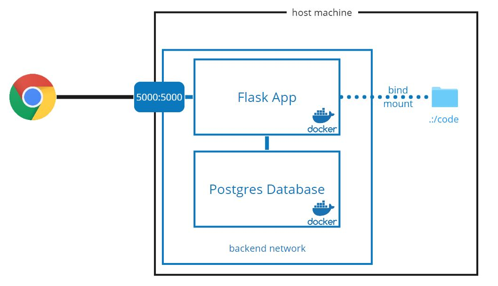

# Stores REST API Testing

Based on [Udemy course on TDD](https://www.udemy.com/automated-software-testing-with-python).

Bhuilt with Flask, Flask-RESTful, Flask-JWT, and Flask-SQLAlchemy.

Deployed with Docker.

## Getting Started



### Running App

The app stack consists of two service containers:

- A Flask App (with app code as a bind mount)
- A Postgres Database

To start the app use the `docker-compose up` command:

```bash
docker-compose up
```
    
This *should* expose port `5000` on localhost.\

### Testing

#### Docker on Windows

You can also use the [Pycharm Docker](https://www.jetbrains.com/help/idea/docker.html)
plugin to set this up.

Stop the app stack before running the tests.

1. Run Python Unit Tests with `docker-compose`:

    ```shell
    $ docker-compose -f docker-compose.unittests.yml up
    
    ...
    
    app_1       | ----------------------------------------------------------------------
    app_1       | Ran 31 tests in 1.514s
    app_1       |
    app_1       | OK
    code_app_1 exited with code 0
    ```
    
    This will build the app containers and lauch python unittest module with all
    the tests in the /tests folder (except for the API tests, which is done by 
    newman). You may edit the `command:` in the *docker-compose.unittests.yml*
    to selectively test parts of the app:
    
    - `python -m unittest discover -v -s tests/unit -t . -p "test_*.py"`
    to run unit tests only
    - `python -m unittest discover -v -s tests/integration -t . -p "test_*.py"`
    to run integration tests only
    - `python -m unittest discover -v -s tests/system -t . -p "test_*.py"`
    to run the system tests only
    
    > Note:
    > - `-v` verbose
    > - `-s <start directory>` where to look for test cases
    > - `-t <top level directory>` where your top directory is, (`.` means source code root)
    > - `-p <pattern>` file naming pattern for test cases
    
    Now, wait for the tests to finish. The last message you should see is
    `code_app_1 exited with code 0`, after which you may "gracefully" stop the
    containers with <kbd>CTRL</kbd>+<kbd>C</kbd>. Don't forget to clean your
    docker environment with a `docker-compose down` afterwards.

2. Run API tests using newman:
    
    ```shell
    $ docker-compose -f docker-compose.newmantests.yml up
    
    ...
    
    newman_1    |
    newman_1    | ┌─────────────────────────┬──────────┬──────────┐
    newman_1    | │                         │ executed │   failed │
    newman_1    | ├─────────────────────────┼──────────┼──────────┤
    newman_1    | │              iterations │        1 │        0 │
    newman_1    | ├─────────────────────────┼──────────┼──────────┤
    newman_1    | │                requests │        8 │        0 │
    newman_1    | ├─────────────────────────┼──────────┼──────────┤
    newman_1    | │            test-scripts │        8 │        0 │
    newman_1    | ├─────────────────────────┼──────────┼──────────┤
    newman_1    | │      prerequest-scripts │        0 │        0 │
    newman_1    | ├─────────────────────────┼──────────┼──────────┤
    newman_1    | │              assertions │       41 │        0 │
    newman_1    | ├─────────────────────────┴──────────┴──────────┤
    newman_1    | │ total run duration: 446ms                     │
    newman_1    | ├───────────────────────────────────────────────┤
    newman_1    | │ total data received: 670B (approx)            │
    newman_1    | ├───────────────────────────────────────────────┤
    newman_1    | │ average response time: 32ms                   │
    newman_1    | └───────────────────────────────────────────────┘
    code_newman_1 exited with code 0
    ```
    
    Note the `code 0` exit, which means the tests passed successfully.
    
    Stop the containers with <kbd>CTRL</kbd>+<kbd>C</kbd>. Don't forget to clean your
    docker environment with a `docker-compose down` afterwards.